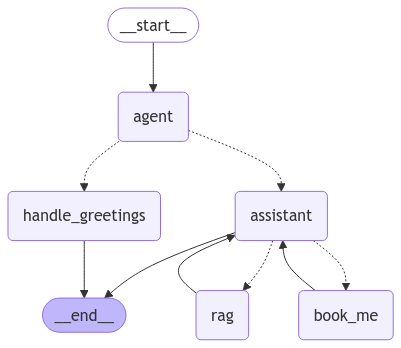

# LangGraph

LangGraph is a Python project that provides tools for building and analyzing language graphs.


## Installation

### Prerequisites

- [Conda](https://docs.conda.io/projects/conda/en/latest/user-guide/install/index.html) (Anaconda or Miniconda)

### Steps

1. Clone the repository:
    ```bash
    git clone https://github.com/yourusername/LangGraph.git
    cd LangGraphAjeet
    ```

2. Create a new conda environment:
    ```bash
    conda create -p venv python=3.11
    ```

3. Activate the conda environment:
    ```bash
    conda activate venv
    ```

4. Install the required dependencies:
    ```bash
    pip install -r requirements.txt
    ```

## Usage

Provide examples of how to use your project. For example:

```bash
uvicorn server:app --reload
```

## Contributing

Contributions are welcome! Please read the [contributing guidelines](CONTRIBUTING.md) for more information.

## License

This project is licensed under the MIT License - see the [LICENSE](LICENSE) file for details.

## Contact

For any questions or suggestions, please open an issue or contact the project maintainer at ajeetacharya02@gmail.com